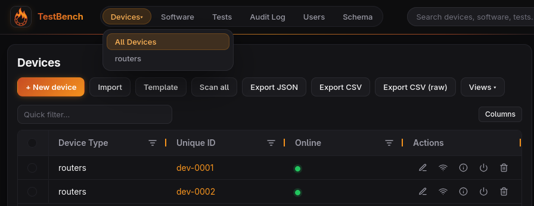
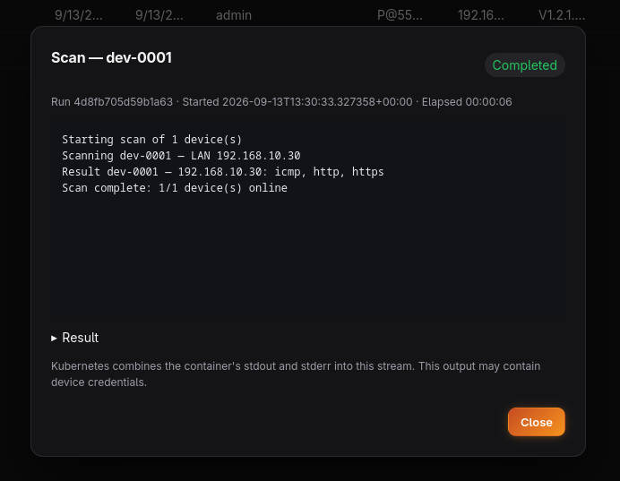
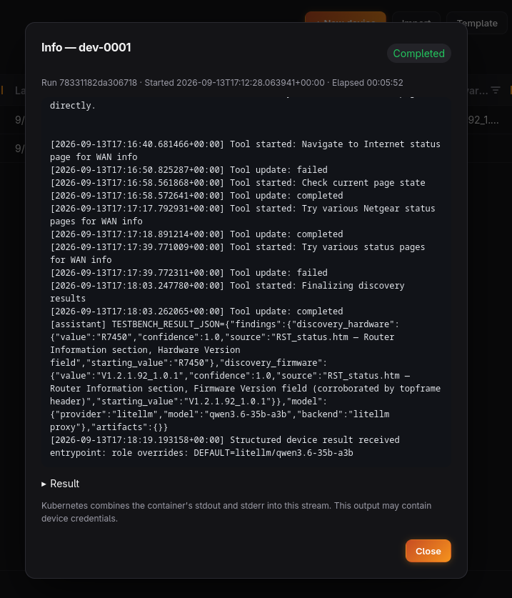
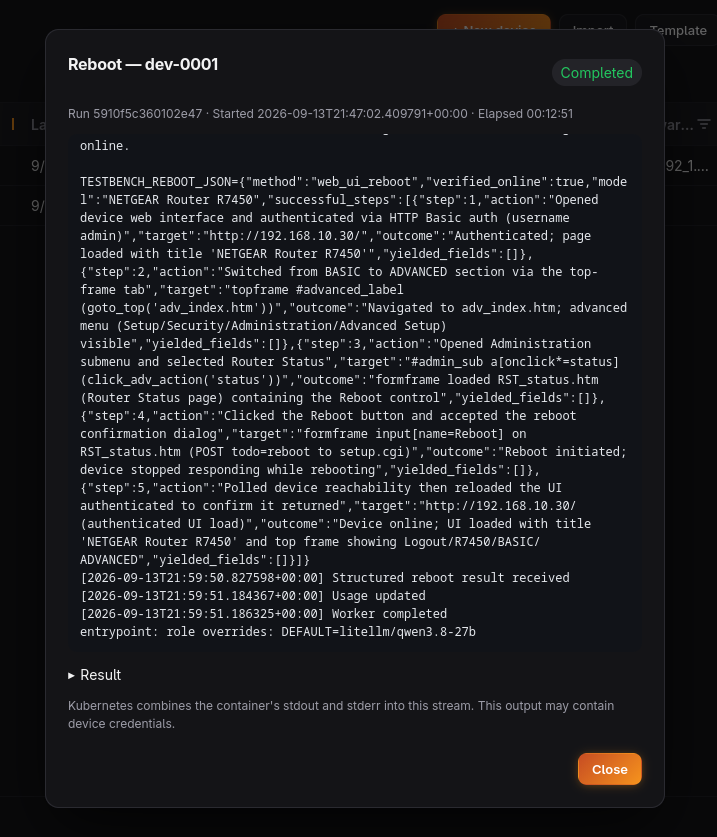

# TestBench

TestBench helps teams manage shared test devices, track the software used on them,
and record test results. It brings inventory, device availability, software
compatibility, and testing history into one web app.



- **Device inventory:** organize devices by type, with configurable fields for
  locations, hardware, firmware, network addresses, and other details. Change a
  device's type from its detail-page editor when it moves to another schema.
- **Shared equipment:** check devices out, track return dates, and receive
  upcoming and overdue reminders.
- **Software and tests:** track software versions, vendor compatibility claims,
  and actual test outcomes against individual devices.
- **Team access:** admin, tester, and read-only roles, with an audit trail of changes.
- **Data access:** spreadsheet-style editing, JSON/CSV import and export,
  additive DeviceSchema YAML import/export, a REST API, and an optional
  read-only MCP server for AI assistants.

## Images

The chart defaults to registry `ghcr.io`, with TestBench images under
`chainfirelabs/testbench` and tag `1.8.8`.

| Image repository | Purpose |
|---|---|
| `chainfirelabs/testbench/frontend` | The web interface. |
| `chainfirelabs/testbench/backend` | The application API, authentication, inventory, and test records. Also used by the chart's database schema setup job. |
| `chainfirelabs/testbench/mcp` | Optional read-only access for AI assistants through the Model Context Protocol. |
| `chainfirelabs/testbench/network-scan` | Network Scan plugin controller and scan workers. |
| `chainfirelabs/testbench/device-info` | Device Info plugin controller, which starts device discovery jobs. |
| `chainfirelabs/testbench/reboot` | Reboot plugin controller and SSH reboot workers. |
| `oh-my-pi` | Separate browser-agent image used by Device Info and browser-based reboot jobs. Defaults to tag `latest`; configure a compatible image available in your registry. |

Set `global.imageRegistry` to change the default registry for images. Repositories
are relative to that registry; set it to `""` to use fully qualified repository
names. Each image has a `repository`, `tag`, and optional `digest`; a digest
takes precedence over the tag. Browser-agent images use the plugin's
`researchImage` settings and must provide Python 3, `/usr/local/bin/entrypoint.sh`,
and `omp acp` with ACP v1 support.

Individual Helm `image` and `researchImage` settings accept `registry` to
override `global.imageRegistry`. Omit it to inherit the global default, or set
`registry: ""` to use a fully qualified repository as written. See the
[per-image registry example](helm/testbench/README.md#private-container-registry).

## Plugins

Plugins add optional actions to the device inventory. All three are disabled by
default. Enable a plugin in Helm, then allow it for the relevant device types in
**Schema → Plugins**. Device fields use semantic roles, such as
`scan_address_lan` or `device_vendor`, so plugins can work with your own column names.

| Plugin | What it does | Helm switch |
|---|---|---|
| Network Scan | Checks device reachability through individual scans, Scan all, or scheduled scans. | `plugins.networkScan.enabled: true` |
| Device Info | Uses a browser agent to identify hardware, firmware, and MAC details on eligible online devices. Confirms before starting the agent and saves successful discovery steps for reuse. | `plugins.deviceInfo.enabled: true` |
| Reboot | Restarts eligible online devices and checks that they return online. Uses per-type SSH or AI browser settings with global defaults. | `plugins.reboot.enabled: true` |

Device Info and Reboot use per-device credentials. Browser-agent actions require
an AI endpoint, model, and API-key Secret; SSH reboot does not. Saved steps can
be viewed, edited, or cleared in the device's **Plugin Steps** tab. Reboot must
be allowed explicitly per device type.

### Network Scan

Network Scan reports each address and successful probe while it checks device
reachability.



### Device Info

Device Info streams the browser agent's progress and presents the structured
hardware and firmware findings when research completes.



### Reboot

Reboot streams the selected SSH or browser-agent workflow and verifies that the
device returns online.



## Install with Helm

The [TestBench chart](helm/testbench/) supports Kubernetes 1.27 or newer. It
installs the frontend and backend, plus any enabled plugins and MCP server.
Provide an existing PostgreSQL database and login; the chart creates and updates
application tables using that login.

Create these Kubernetes Secrets in the release namespace before installation:

| Secret in the example | Required keys |
|---|---|
| `testbench-database` | `username` and `password` for the existing PostgreSQL database. |
| `testbench-application` | `TB_JWT_SECRET` with a long random signing secret. Set `TB_ADMIN_USERNAME` and `TB_ADMIN_PASSWORD` for the initial admin account. |
| `testbench-plugins` (when enabling plugins) | `shared-secret` for communication between the backend and plugins. |

Save your settings in `my-values.yaml`, for example:

```yaml
database:
  host: postgres.example.com
  name: testbench
  sslmode: require
  credentials:
    existingSecret: testbench-database

applicationSecret:
  existingSecret: testbench-application

config:
  frontendUrl: https://testbench.example.com
  corsOrigins: https://testbench.example.com
  timezone: America/New_York

ingress:
  enabled: true
  className: nginx
  hosts:
    - host: testbench.example.com
      paths:
        - path: /
          pathType: Prefix
  tls:
    - secretName: testbench-tls
      hosts: [testbench.example.com]
```

This example assumes an installed ingress controller and an existing TLS Secret
named `testbench-tls`.

```bash
helm upgrade --install testbench ./helm/testbench \
  --namespace testbench --create-namespace \
  --values my-values.yaml
```

## Helm values

The tables below cover the main settings. The commented
[values.yaml](helm/testbench/values.yaml) contains every value and the complete
starter device catalog.

### Application and networking

| Value | Default / options |
|---|---|
| `global.imageRegistry` | `ghcr.io`; registry host with optional port/path, without a URL scheme. |
| `global.imagePullSecrets` | `[]`; existing registry Secret references, e.g. `[{name: registry-credentials}]`. |
| `frontend.replicaCount` / `backend.replicaCount` | `2` each. |
| `frontend.image.*` / `backend.image.*` | Image repository, tag, digest, and `pullPolicy`: `IfNotPresent`, `Always`, or `Never`. |
| `frontend.resources` / `backend.resources` | CPU and memory requests and limits; see values.yaml for defaults. |
| `frontend.service.type` | `ClusterIP`, `NodePort`, or `LoadBalancer`; default `ClusterIP`. |
| `frontend.service.port` / `nodePort` | `80` / unset; optional fixed node port for NodePort or LoadBalancer services. |
| `applicationSecret.existingSecret` | Required existing Secret containing application `TB_*` secrets. |
| `config.frontendUrl` | Required public URL, such as `https://testbench.example.com`. |
| `config.corsOrigins` | Required comma-separated browser origins. Usually the public URL. |
| `config.timezone` | `UTC`; an IANA timezone such as `America/New_York`. |
| `config.checkoutSweepMinutes` | `60`; reminder check interval in minutes. `0` disables checks. |
| `config.checkoutWarnDays` | `3`; days before a return date that warnings begin. |
| `ingress.enabled` / `className` | `false` / `""`; enable ingress and choose a controller class, or leave the class empty for the cluster default. |
| `ingress.hosts` / `tls` / `annotations` | `[]` / `[]` / `{}`; host paths, TLS Secret references, and controller annotations. |

### PostgreSQL

| Value | Default / options |
|---|---|
| `database.host` | Required PostgreSQL hostname. |
| `database.port` / `name` | `5432` / `testbench`. |
| `database.sslmode` | `require`; also accepts `disable`, `allow`, `prefer`, `verify-ca`, or `verify-full`. |
| `database.credentials.existingSecret` | Required Secret containing the database login. |
| `database.credentials.usernameKey` / `passwordKey` | `username` / `password`; keys within that Secret. |
| `database.waitTimeoutSeconds` / `waitIntervalSeconds` | `120` / `5`; how long schema setup waits for the database and how often it retries. |

### Inventory fields

The example external catalog starts with Routers, Mobile Phones, and Servers.
Administrators can manage device types and the Device, Software, and Test fields
in **Schema**.

| Value | Default / options |
|---|---|
| `schema.devices.source` | `database` (default) leaves configuration to the admin GUI; `configMap` loads an external YAML catalog. |
| `schema.devices.reconciliation` | `bootstrap` imports once, then hands ownership to the GUI. `merge` adds configuration without deleting GUI-created entries and reports conflicts. `authoritative` keeps YAML in control. |
| `schema.devices.existingConfigMap` / `key` | Required ConfigMap name / `device-schema.yaml`; the chart mounts this external bootstrap document. |
| `schema.devices.allowGlobalExclusions` | `false`; whether device types may exclude global fields. |
| `schema.devices.rejectUnknownFields` | `false`; set `true` to reject writes containing undefined field keys. |
| `schema.software.optionalFields` / `schema.tests.optionalFields` | Lists of optional built-in fields to include in the initial catalog. |
| `schema.software.additionalFields` / `schema.tests.additionalFields` | `[]`; custom field definitions, e.g. `[{key: lab, label: Lab, type: select, options: [East, West]}]`. |

Required identity and relationship fields are always included. See
[device schema configuration](docs/device-schema.md) for field types and semantic roles.

The Schema page can download the live DeviceSchema as bootstrap YAML and import
either that ConfigMap or a raw `DeviceSchema` document. Import shows a preview
and is strictly additive: it creates only missing fields, types, layouts, and
plugin assignments; it never changes or deletes existing configuration.

### Plugin settings

All plugins require `plugins.sharedSecret.existingSecret`; its key defaults to
`shared-secret`. Each plugin has image settings and `maxConcurrentPods` (default
`5`) to limit how many of its jobs run at once.

| Values under `plugins.` | Default / options |
|---|---|
| `networkScan.timeoutSeconds` / `concurrency` | `2` seconds per connection / `10` devices probed concurrently per worker. |
| `networkScan.intervalMinutes` | `15`; set `0` to disable scheduled scans. |
| `deviceInfo.ai.url` / `reboot.ai.url` | Required when enabled; an OpenAI-compatible API base URL reachable by the jobs. |
| `deviceInfo.ai.model` / `reboot.ai.model` | Required when enabled; model identifier accepted by the endpoint. |
| `deviceInfo.ai.repeatModel` | `""`; optional model for repeat lookups using saved steps. Empty uses `ai.model`. |
| `deviceInfo.ai.existingSecret` / `reboot.ai.existingSecret` | Required when enabled; API-key Secret in the job namespace. `ai.apiKeySecretKey` defaults to `OPENAI_API_KEY`. |
| `deviceInfo.prompt` / `reboot.prompt` | Task instructions supporting `{device_url}` and `{device_json}`. Credentials and required result instructions are appended automatically. |
| `deviceInfo.researchImage.*` / `reboot.researchImage.*` | Browser-agent repository, tag, and optional digest. |
| `deviceInfo.httpPort` / `deviceInfo.httpsPort` | `80` / `443`; global web-interface ports. Type, ordered-rule, and device `http_port` / `https_port` settings override them independently. Device Info gives the agent HTTPS then HTTP candidates. |
| `reboot.method` | `ai`; global method (`ssh` or `ai`). Per-type plugin `config.method` overrides it. Replaces vendor matching. |
| `reboot.sshCommand` | `reboot`; global nonempty SSH command. Type, ordered-rule, and device `ssh_command` settings override it; null/omitted inherits. |
| `reboot.sshPort` | `22`; global SSH port. Type, ordered-rule, and device `ssh_port` settings use the same override precedence. |
| `reboot.recoveryTimeoutSeconds` | `300`; time allowed for a device to return online. |

Job settings live under `networkScan.worker`, `deviceInfo.research`, and
`reboot.worker`. Each supports `namespace` (empty uses the release namespace),
`createNamespace` (default `false`), and additional `imagePullSecrets`. Registry
Secrets must exist in each namespace that uses them.

| Job setting | Network Scan | Device Info | Reboot |
|---|---|---|---|
| `ttlSecondsAfterFinished` — completed job retention | `300` | `900` | `600` |
| `activeDeadlineSeconds` — maximum job runtime | `1800` | `1800` | `900` |

The `allowedEgressCidrs` setting is reserved and currently has no effect.

SSH reboot streams connection, command, outage, and recovery progress into the
run dialog. It watches the resolved SSH host and port, requires two consecutive
successful probes after observing an outage, and fails clearly if SSH never
goes offline within 60 seconds.

### MCP server

| Value | Default / options |
|---|---|
| `mcp.enabled` / `replicaCount` | `false` / `1`. |
| `mcp.image.*` / `resources` | Image selection, pull policy, and CPU/memory requests and limits. |
| `mcp.service.port` / `mountPath` | `8003` / `/mcp`; exposed through an internal ClusterIP service. |
| `mcp.authToken.existingSecret` / `key` | `""` / `auth-token`; optional Secret requiring a bearer token from MCP clients. Without it, callers inside the cluster do not authenticate. |
| `mcp.defaultLimit` / `maxLimit` | `50` / `500` records; maximum limit may be set up to `1000`. |
| `mcp.maxResponseBytes` | `131072`; response size limit in bytes. |

The chart configures read-only access from MCP to the backend automatically.
External MCP clients need a separately configured ingress or gateway.

## API client libraries

- [Python client](src/python-client/README.md): queries, device checkout, and test result recording.
- [Go client](src/go-client/README.md): API-token queries for inventory, software, tests, schemas, and device actions.

### TestBench Go command

Build the CLI into `bin/` from the repository root, then configure your API token:

```bash
mkdir -p bin
go -C src/go-client build -o ../../bin/testbench ./cmd/testbench
export TB_API_URL=https://testbench.example.com
export TB_API_KEY=tb_your_prefix_your_secret
./bin/testbench --devices
./bin/testbench --devices --type router
./bin/testbench --devices --filter 'make=MikroTik'
./bin/testbench --software --search curl --latest
./bin/testbench --tests --for-device dev-0042 --outcome fail
./bin/testbench --help
```

If the binary is already in `bin/`, skip the build. Mint a token under
**Profile → API keys**. To run `testbench` without a relative path, run
`export PATH="$PWD/bin:$PATH"` from the repository root.
See the [Go CLI guide](src/go-client/README.md#command-line-executable) for
column discovery, JSON/CSV output, sorting, limits, and permanent PATH setup.

## License

TestBench is copyright 2026 ChainFire Labs and released under the
[MIT License](LICENSE). Third-party dependencies and container components keep
their own licenses; see [Third-party software](THIRD_PARTY_NOTICES.md).
